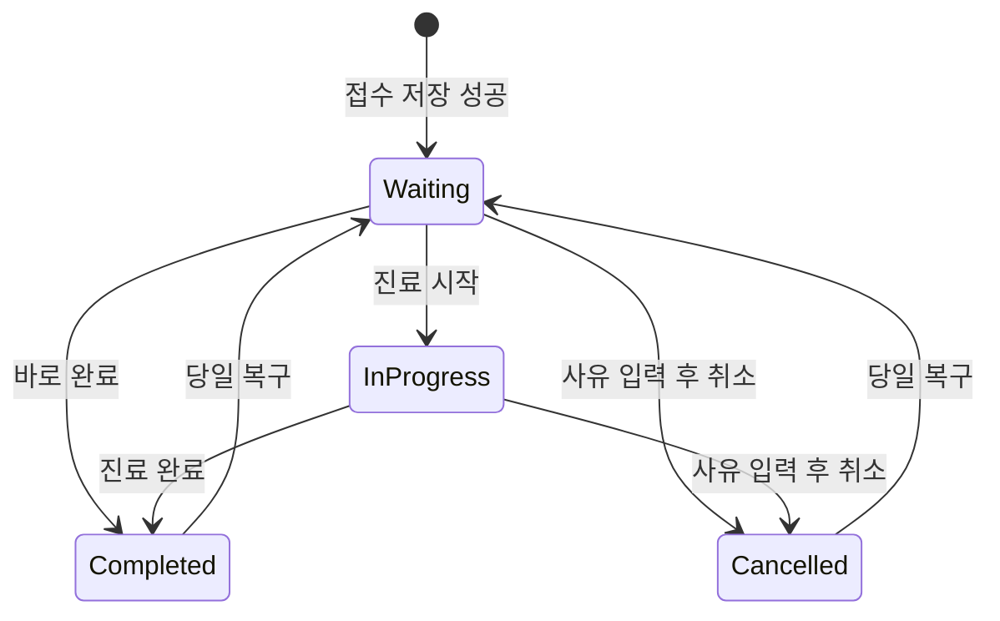

# 건강진료센터 셀프 접수 · 관리자 시스템

교내 건강진료센터의 수기 접수와 반복 입력 업무를 줄이기 위해 만든 **기기 로컬형 접수 보조 웹앱**입니다. 방문자는 태블릿에서 접수하고 담당자는 같은 기기/브라우저에서 상태와 처치 기록을 관리합니다.

> v1.1 개선: 운영 오류 대응, 화면 잠금, 취소·복구, 기록 변경 이력, 동시 쓰기 제어, 암호화 백업, 테스트를 추가했습니다. **서버 인증이나 기기 간 동기화는 구현하지 않았습니다.** 실제 운영 전 [운영 안내](docs/OPERATIONS.md)와 [보안 한계](SECURITY.md)를 확인하세요.

## 프로젝트 배경

- 종이에 적은 접수 정보를 담당자가 다시 입력하고, 접수지를 보관·폐기하는 부담
- 방문자가 몰리는 시간대의 명단 작성과 반복 안내
- 간호사 피드백에 따른 세부 증상 선택·직접 입력·체온 기록의 필요성
- 기존 학교 시스템의 API 접근 제약으로 직접 통합 대신 화면 복사와 CSV 전달을 선택

현장 피드백은 [이슈 #1: 복사 중심 UX](https://github.com/heewonjung2/health-center-self-checkin-admin/issues/1), [#3: 접수 취소](https://github.com/heewonjung2/health-center-self-checkin-admin/issues/3), [#4: 세부 증상](https://github.com/heewonjung2/health-center-self-checkin-admin/issues/4), [#5: 체온·세부 증상 반영](https://github.com/heewonjung2/health-center-self-checkin-admin/issues/5)에 남아 있습니다. 효과 수치를 실제로 측정하지 않았으므로 절감률·처리시간 개선 수치는 주장하지 않습니다.

## 실행

Node.js 22 LTS 이상과 npm이 필요합니다.

```bash
git clone https://github.com/heewonjung2/health-center-self-checkin-admin.git
cd health-center-self-checkin-admin
npm ci
npm run dev
```

개발 서버가 표시하는 localhost 주소를 엽니다. 운영 환경은 HTTPS가 필요합니다. API 키나 `.env` 설정은 필요하지 않습니다. 담당자가 최초 PIN을 설정한 뒤 방문자 접수를 사용할 수 있습니다. PIN은 기기/브라우저별로 다릅니다.

```bash
npm run check        # lint → 테스트 → production build
npm run test:watch   # 테스트 개발 모드
npm run format      # 코드 서식 정리
npm run build
npm run preview     # 로컬 production 산출물 확인
npm audit           # 전체 의존성 취약점 확인
```

## 주요 기능

| 영역        | 구현 내용                                                                                                                           |
| ----------- | ----------------------------------------------------------------------------------------------------------------------------------- |
| 방문자 접수 | 학번/직원 번호, 이름, 2단계 증상 선택(복수 선택)·직접 입력, 두통/감기일 때만 묻는 선택 항목 체온, 저장 성공 후 접수번호(`001`) 안내 |
| 공용 화면   | 이름 대신 접수번호 표시, 90초 입력 중단 시 폼 삭제, 완료 안내 20초 후 초기화                                                        |
| 키오스크    | `?kiosk=1` 주소로 담당자 버튼·설정 배너 숨김, 로고 5회 탭으로 담당자 진입                                                           |
| 운영 시간   | 설정한 시간(기본 평일 09:00–17:30) 밖에는 방문자 접수 차단, 담당자 화면은 영향 없음                                                 |
| 중복 방지   | 같은 날짜·학번의 진행 중 접수 중복 차단, 빠른 연속 클릭 차단                                                                        |
| 담당자 화면 | PIN 최초 설정·변경·복구 코드, 5분 무활동/탭 숨김 시 잠금, 날짜·상태·이름·학번·접수번호 필터                                         |
| 일별 요약   | 선택 날짜의 상태별 건수, 방문 목적 분포, 평균 체온, 발열(37.5℃ 이상) 인원                                                           |
| 기록 관리   | 진료 시작·완료, 기록 수정, 사유가 있는 접수 취소, 당일 대기 복구, 변경 이력                                                         |
| 데이터      | schemaVersion 2, 기존 배열 이관, 한국 시간 날짜, 기록 version 충돌 검사, Web Locks 쓰기 직렬화                                      |
| 오류 대응   | 손상·지원하지 않는 형식·저장 실패 안내, 원본 보존, 이전 버전 탭 충돌 차단, 화면 오류 경계                                           |
| 내보내기    | 현재 필터의 CSV, 학번/전체 복사, BOM·따옴표·수식 시작 문자 처리                                                                     |
| 백업        | PBKDF2 + AES-256-GCM 암호화 파일, 복원 미리 확인, 기존 기록을 덮어쓰지 않는 병합                                                    |
| 유지보수    | 컴포넌트/도메인/저장소 분리, Vitest·Testing Library, GitHub Actions, 보안·운영 문서                                                 |

체온은 선택 항목이며 두통·감기를 고른 경우에만 입력란이 나타납니다. 입력하지 않으면 `미기록`으로 저장되고 평균 체온·발열 집계에서 제외됩니다. 체온 범위(34.0~42.0℃)는 기존 데이터 입력 규칙을 유지한 것이며 진단이나 응급 여부 판정에 사용하지 않습니다.

## 접수 상태 흐름



복구 시 이미 같은 학번의 진행 중 접수가 있으면 차단합니다. 취소는 데이터의 영구 삭제가 아닌 상태 변경입니다. 모든 상태의 기록은 동일한 보관 규칙을 따릅니다.

## 설계와 기술적 선택

### 기존 제약을 유지하면서 안정성 개선

외부 의료정보 DB를 임의로 추가하지 않고 로컬 저장 방식을 유지했습니다. 따라서 다른 기기와 실시간 동기화되지 않습니다. 같은 출처의 다른 탭에는 `storage` 이벤트로 갱신을 알리지만, 쓰기는 Web Locks로 전체 읽기·변경·저장을 직렬화합니다.

### 저장 성공이 먼저, 완료 안내는 나중

이전 구현은 React 상태 변경 직후 완료 안내를 표시하고 저장은 effect에서 처리했습니다. 새 구현은 저장 결과를 기다린 후 안내합니다. 저장 실패 시 입력값을 유지하고, 손상 데이터를 빈 배열로 덮어쓰지 않습니다.

### 기록 수정 충돌 방지

편집을 시작할 때의 `version`과 저장 순간의 최신 `version`을 비교합니다. 다른 탭에서 먼저 수정했다면 덮어쓰지 않고 최신 기록을 다시 확인하도록 안내합니다.

### 기존 기록 이관과 보관 기한

기존 배열을 검증한 뒤 별도의 v2 키에 저장하고, 성공한 경우에만 기존 키를 제거합니다. 기존 보관 경계인 ‘한국 시간 기준 오늘~30일 전 날짜’를 유지합니다. 시작 시와 실행 중 1분마다 정리하며 앱 종료 중에는 실행되지 않습니다. **구형 코드로 단순 롤백하면 새 기록을 읽을 수 없으므로** 운영 안내의 전환 절차를 따릅니다.

### 화면 잠금과 보안 한계

PIN·복구 코드 검증값에는 PBKDF2-SHA-256과 랜덤 salt를 사용합니다. 하지만 이는 화면 잠금이지 서버 인증이 아닙니다. 로컬 원본 기록은 평문이며 기기에 접근 가능한 사용자의 개발자 도구를 막지 못합니다. 백업 파일 암호화와 원본 저장 암호화는 구별합니다. 복구 코드는 PIN 설정 직후 1회만 표시되며 해시만 저장합니다. [자세한 범위](SECURITY.md)

### 여러 대의 기기로 나누어 쓸 수 없음

접수 태블릿, 근로장학생 PC, 간호사 PC를 각각 두고 같은 배포 주소를 열어도 **데이터가 공유되지 않습니다.** 각 브라우저가 자기 `localStorage`만 사용하기 때문입니다. 현재 구조는 **접수와 기록 관리를 한 대의 기기**에서 하는 것을 전제로 합니다. 역할별로 기기를 나누려면 기관 승인을 받은 공유 저장소(서버/DB)가 필요하며, 이는 후속 작업입니다.

## 구조

| 경로                 | 역할                                                    |
| -------------------- | ------------------------------------------------------- |
| `src/App.jsx`        | 화면 전환·관리자 세션·자동 잠금                         |
| `src/components/`    | 접수, 관리자 목록, 편집, 대화상자, 백업/설정, 오류 경계 |
| `src/domain/`        | 검증, 상태 전환, 날짜·보관 기한, 이관, 복원 병합        |
| `src/lib/`           | 저장 트랜잭션, PIN, 암호화, CSV·복사                    |
| `src/hooks/`         | 저장소와 React 상태 연결                                |
| `src/styles/`        | 공통 색상·디자인 변수                                   |
| `tests/`             | 도메인·저장·보안·React 상호작용 회귀 테스트             |
| `docs/OPERATIONS.md` | 실제 적용·복구·롤백·기기 검증 절차                      |

## 기술 스택

React 19, Vite 6, JavaScript ESM, CSS, Web Storage, Web Locks, Web Crypto, Vitest 3, Testing Library, ESLint, Prettier. 런타임 의존성은 React와 React DOM입니다.

## 테스트와 운영 확인

자동화 테스트는 체온 경계, 필수 입력, 증상 선택, 한국 시간 날짜, 기존 기록 이관, 보관 기간, 중복 접수, 상태 전환, 수정 충돌, 저장 실패, PIN 검증/시도 제한, 백업 암호화/변조, CSV 처리, 폼 초기화, 관리자 접근과 무활동 잠금을 검사합니다. 테스트 데이터는 가상 정보만 사용합니다.

CI는 PR과 main 변경에서 lint/test/build와 의존성 검사를 실행합니다. 실제 태블릿·Excel·호스팅 보안 헤더는 별도 확인 대상이며, 자동화 테스트 통과만으로 운영 승인을 대신하지 않습니다. 검증하지 않은 UI 화면이나 운영 성과는 문서에 완료로 표기하지 않습니다.

## 향후 확장 범위

기관 승인을 받은 서버/DB, 담당자별 계정·서버 권한 검사, 기기 간 동기화, 변경 불가 감사 로그, 운영 성과 측정은 후속 작업입니다. 신규 인프라 없이 가능한 프론트엔드 개선과 구분합니다.

변경 요약은 [CHANGELOG](CHANGELOG.md), 운영 전 점검은 [운영 안내](docs/OPERATIONS.md)를 참고하세요.
